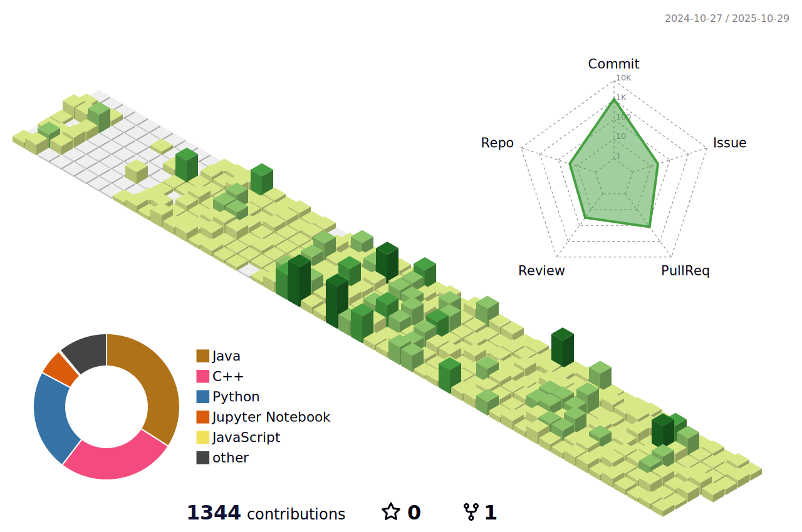

<!-- 
<h1>📜 Career</h1>

<table align="center">
  <thead>
    <tr>
      <th>Date</th>
      <th>Content</th>
      <th>비고</th>
    </tr>
  </thead>
  <tbody>
    <tr>
      <td><strong>2024.06~2024.07</strong></td>
      <td>Intern at HL Mando MSI (Bangaluru, India )</td>
      <td>-</td>
    </tr>
    <tr>
      <td><strong>2024.07</strong></td>
      <td>INDO.KOREA International Conference 2024</td>
      <td>참가상</td>
    </tr>
    <tr>
      <td><strong>2024.11.22</strong></td>
      <td>추계한국정보기술학회 우수논문상</td>
      <td>동상</td>
    </tr>
    <tr>
      <td><strong>2024.12.12</strong></td>
      <td>산학프로젝트 경진대회 데이터스트림즈팀</td>
      <td>우수상</td>
    </tr>
    <tr>
      <td><strong>2024.09~2024.12</strong></td>
      <td>KNU 자료구조응용(COMP0216-004) 튜터</td>
      <td>-</td>
    </tr>
    <tr>
      <td><strong>2025.04.04</strong></td>
      <td>SQLD 자격증 취득</td>
      <td>-</td>
    </tr>
    <tr>
      <td><strong>2025.04~</strong></td>
      <td>카카오테크 캠퍼스 3기 (Backend)</td>
      <td>-</td>
    </tr>
        <tr>
      <td><strong>2025.06.13</strong></td>
      <td>ADSP 자격증 취득</td>
      <td>-</td>
    </tr>
  </tbody>
</table> -->

<h3>Experience</h3>

* **카카오테크캠퍼스** 2기 BE (2024.04 ~ 2024.11)
  * 카카오테크캠퍼스 아이디어톤 (2024.08.22)
  * 카카오테크캠퍼스 프로젝트 [**'딸깍'**](https://github.com/Dockerel/Team5_BE) 서비스 개발 (2024.09 ~ 2024.11)
 

* **Google Developers Group on Campus** KNU 4기 BE (2025.02 ~ 2025.05)
  * GDGoc 솔루션 챌린지 프로젝트 [**'토닥'**](https://github.com/Dockerel/4th-SC-TEAM1-BE) 서비스 개발 (2025.02 ~ 2025.05)
 

* **경북대학교** 컴퓨터학부 20학번 (2020.03 ~ 2025.06)
  * 경북대학교 산학협력프로젝트1 with **데이터스트림즈**. [**'빅픽쳐'**](https://github.com/Dockerel/DataStreams-BE) 서비스 개발 (2025.03 ~ 2025.06)

---
<h3>Tech Stack</h3>
<h4>Back-End</h4>

<h4>Front-End</h4>

   

<h4>DB</h4>

---

<h3>PS</h3>

<!--

-->

<!--
---

<h3>GITHUB</h3>

-->
 

